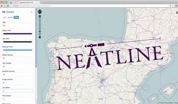
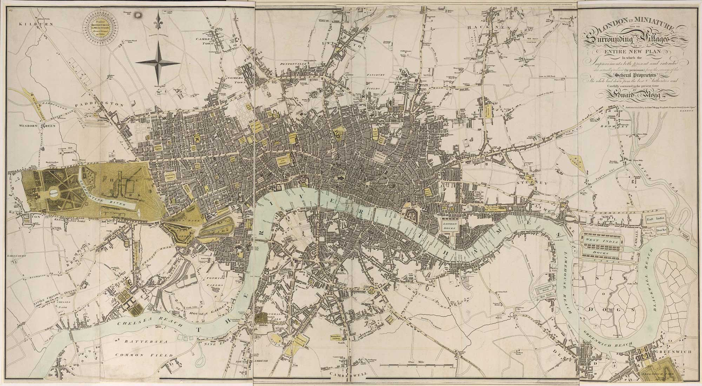
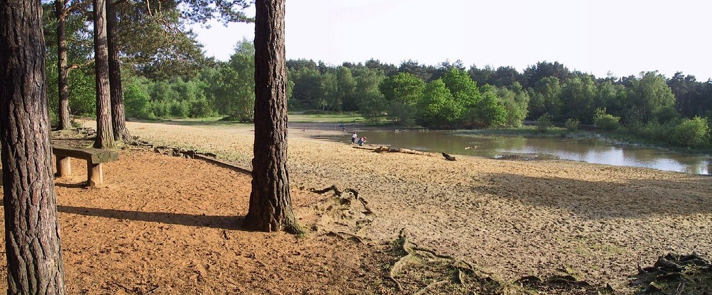
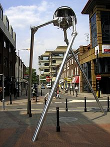

Our project was on neatline. It is a robust mapping tool used for creating interactive exhibits. We researched what was possible with neatline 
along with a failed attempt to create our own interactive exhibit. This failed in part because the "free" method was much more difficult as 
as well as the tool is extremely complex, so much in fact, that an entire course could be dedicated to learning it. Neatline underscores the 
boons of digital humanities by providing a method of representing data which would be unattainable with conventional methods. It allows for 
seamless crossing of interactive mapping and of course text into a single entity. Some might say it adds a spatial element for those who
simply can not just put the pieces together in their head. 

I took up the task of attempting to use neatline and its main plugins; neatline Text, neatline Simile and neatline Waypoints in order to 
create an interactive presentation. I wanted to use each plugin to demonstrate a different aspect of the utility of neatline. For neatline itself,
I had a map of London. NeatlineText was going to reference the Wikipedia page (or the sources of the page, as they are accurate,) beside some pages
in the text referencing noteworthy locations/events. NeatlineWaypoints was to be used to show a couple of the important places in London used in War of the Worlds as the story uses only real 
settings. NeatlineSimile was also to be used to add an entirely new dimension of time to the plot. Since I could never get it working, I could
only provide information for our presentation. This added insight into what neatline was capable of and how it could be used to convey information
effectively. Collaberation allowed us to get an idea just how much world it would take to put together a neatline project as each of us focused
on some aspect of how to get it to work at all. Together we were able to build an understanding of the tool that was just not possible 
by ourselves. I believe in the future, if neatline ever becomes a topic of discussion/work, our entire group will be at an advantage as we had
shared our knowledge. For example Joyce went very in depth into how to run neatline offline, something none of us even understood, but 
she was able to give us a starting point for future reference.

This is the waypoint that would have been used as this is where the aliens first touch down.

This is the second waypoint located at Woking.

