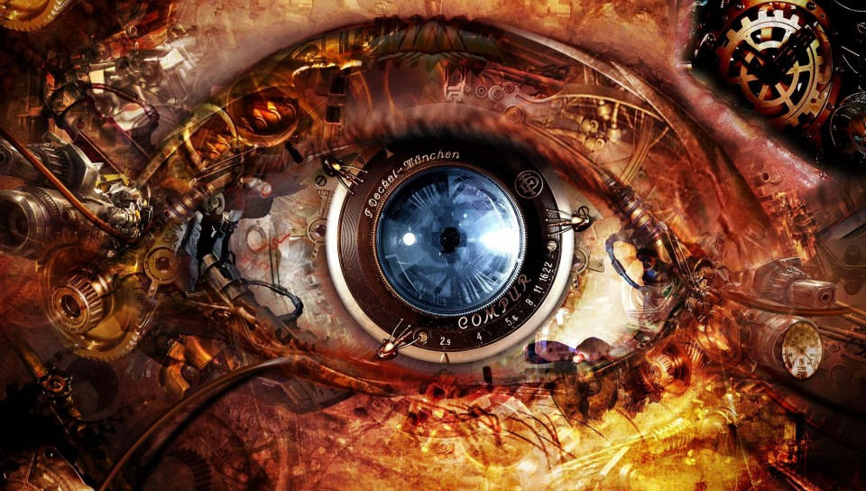

## Christian Montanari
### IASC 2P02

**Bio**

My name is Christian Montanari and I am in my third year at Brock, second year in IASC. I am interested in digital prototyping but I do not like to hold myself down to one specific thing. I like to think outside the box and enjoy what some may call "futurism." In the solo presentations I was the only person who opted to look at a fictional technology which inspired our future which is a good representation of how I like to look at our world. I am an optimist when it comes to technology, seeing the good in everything and a firm believer that the only way forwards is to work with technology, not attempt to undermine it. In our group project we took up the hardest path, and although I ultimated failed learning to use Neatline, I learned some valuable things along the way. I believe that my work in IASC will take me to website development, video game development, or perhaps even entrepreneurship in the future because I have a drive to make something lasting of myself. While I do not claim to have any expertise, there is nothing I cannot learn on computers.

## Featured Project

## Research Presentation 
["CyberSpace"](reveal/index.html)

## Academic Blog
["The Digital Humanities Are Not 'So White'"](Blog.md)

## Collaborative Project
