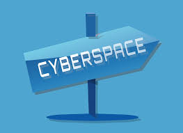

## Christian Montanari
### IASC 2P02

**Bio**

My name is Christian Montanari and I am in my third year at Brock, second year in IASC. I am interested in digital prototyping but I do not like to hold myself down to one specific thing. I like to think outside the box and enjoy what some may call "futurism." In the solo presentations I was the only person who opted to look at a fictional technology which inspired our future which is a good representation of how I like to look at our world. I am an optimist when it comes to technology, seeing the good in everything and a firm believer that the only way forwards is to work with technology, not attempt to undermine it. In our group project we took up the hardest path, and although I ultimated failed learning to use Neatline, I learned some valuable things along the way. I believe that my work in IASC will take me to website development, video game development, or perhaps even entrepreneurship in the future because I have a drive to make something lasting of myself. While I do not claim to have any expertise, there is nothing I cannot learn on computers.

## Featured Project

This project is targetted at the pop culture surrounding the internet before it had fully come to fruition. Based on the "cyberpunk" genre of science fiction books, this idea of cyberspace predates the internet by quite a bit. Altough cyberspace was much different than the internet today, they both described a network of computers all communicating with each other on a massive scale. More importantly, the dark worlds offered a realistic expectation of how skillful hackers would abuse such an expansive system. Unlike most people, my research consisted of reading fiction rather than a wikipedia page. I began by re-reading Gibson's "Sprawl series" and noting points of interest where we can observe the similarities between the two technologies. I think it is important to 'play' with the notion of what is possible in fiction because it inspires future generations. 

This project began as a review into retro futurism. I wanted to learn how science fiction was being used to influence the real world. This is because I had gone into this project with the belief that pop culture today does a poor job of inspiring future generations when it comes to scientific discovery. I quickly found myself with too many examples of my theory being correct and had to choose one specific example. This lead me away from wartime propaganda and towards more nuanced uses of creative future technologies. As I gravitated towards cyberpunk, there were still plenty of tech that I could choose from; Vr, Body modifications, AI. I decided to pick the one that has been around the longest in the same 'spirit' of the story, which is of course, cyberspace. Rather than taking a “wouldnt it be cool if” perspective on cyberspace, I wanted to review the reasons why the internet was such a massive success. During class we discussed the failing of the virtual boy among other technologies too ahead of their time which got me thinking or the reasons why cyberspace would remain nothing more than that of sci fi. The technology during the time of the internet was simply too archaic to support such an immersive and complex system such as cyberspace. Limited by our processing power, we quickly learned that faster was better than gimmicky. This is observed in countless mediums involving the internet such as games (which would always opt for faster refresh rates over better graphics,) websites which would rather be loaded faster and more efficiently than to be flashy and HD video which only became a thing when we could afford the power to do so. It seemed as though cyberspace was not the natural progression of networks we were hoping for but rather just another flashy idea. 

## Research Presentation 
["CyberSpace"](reveal/index.html)

## Academic Blog
["The Digital Humanities Are Not 'So White'"](Blog.md)

## Collaborative Project
["Neatline; Plotting War Of The Worlds"](Collab.md)
